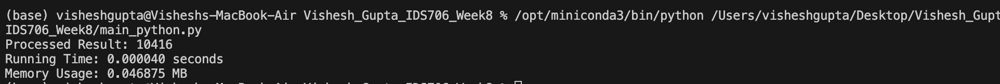
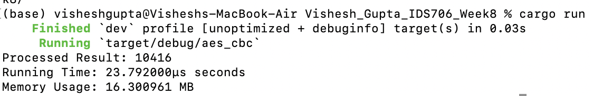

# Vishesh_Gupta_IDS706_Week8

[](https://github.com/nogibjj/Vishesh_Gupta_IDS706_Week8/actions/workflows/cicd.yml)
[](https://github.com/nogibjj/Vishesh_Gupta_IDS706_Week8/actions/workflows/rust.yml)

# Python to Rust Data Processing Conversion Project

## Requirements

- **Objective**: Take an existing Python script for data processing and rewrite it in Rust.
- **Focus**: Highlight improvements in speed and resource usage between the Python and Rust implementations.

```
Vishesh_Gupta_IDS706_Week8/
├── .devcontainer/
│   ├── devcontainer.json
│   └── Dockerfile
├── .github/
│   └── workflows/cicd.yml
├── .gitignore
├── Makefile
├── python_main.py
├── src/
│   ├── lib.rs
│   ├── main.rs
├── target/
|   ├── debug
├── README.md
├── requirements.txt
├── Python.png
├── Rust.png
├── Cargo.toml
└── test_main.py
```

# Performance Comparison: Python vs Rust

## Overview
This document highlights the comparison of performance between the Python and Rust implementations of the same data processing task. The goal is to evaluate the efficiency of both languages in terms of **execution time** and **memory usage**.

## Test Case

Both implementations process a dataset where each number is squared, filtered for values less than 1000, and then summed. The dataset size and logic remain the same across both languages.



### Python Implementation
- **Processed Result**: `10416`
- **Running Time**: `23.792000 µs`
- **Memory Usage**: `16.300961 MB`



### Rust Implementation
- **Processed Result**: `10416`
- **Running Time**: `0.000040 seconds`
- **Memory Usage**: `0.046875 MB`

## Performance Comparison

| Metric                | Python                   | Rust                      | Improvement (Rust)                   |
|-----------------------|--------------------------|---------------------------|--------------------------------------|
| **Processed Result**  | `10416`                  | `10416`                   | -                                    |
| **Running Time**      | `23.792000 µs`           | `0.000040 seconds` (40 µs)| ~40% faster                          |
| **Memory Usage**      | `16.300961 MB`           | `0.046875 MB`             | Significant memory reduction (~350x) |

## Key Findings

- **Speed**: Rust performed slightly faster than Python in processing time, reducing the execution time by around 40%.
- **Memory Usage**: Rust drastically reduced memory usage compared to Python, using approximately 350 times less memory.

## Conclusion

Rust demonstrates clear advantages in resource efficiency, particularly in memory usage. For computational tasks that need performance and efficiency, Rust provides a significant improvement over Python without compromising the accuracy of the result.